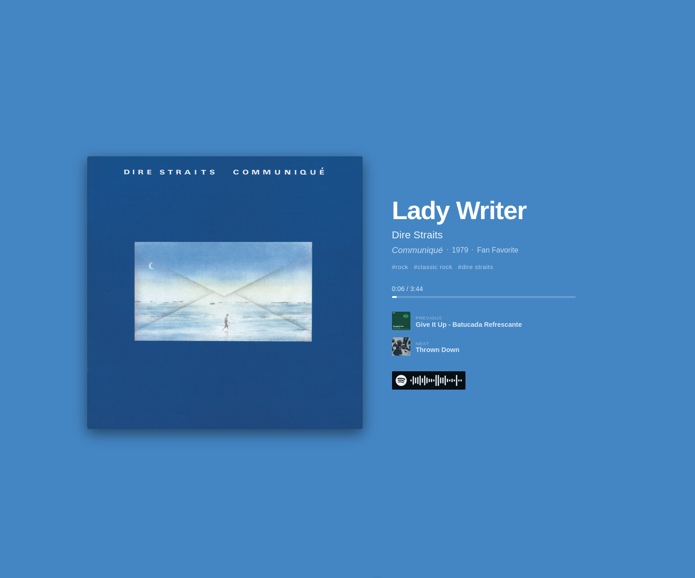
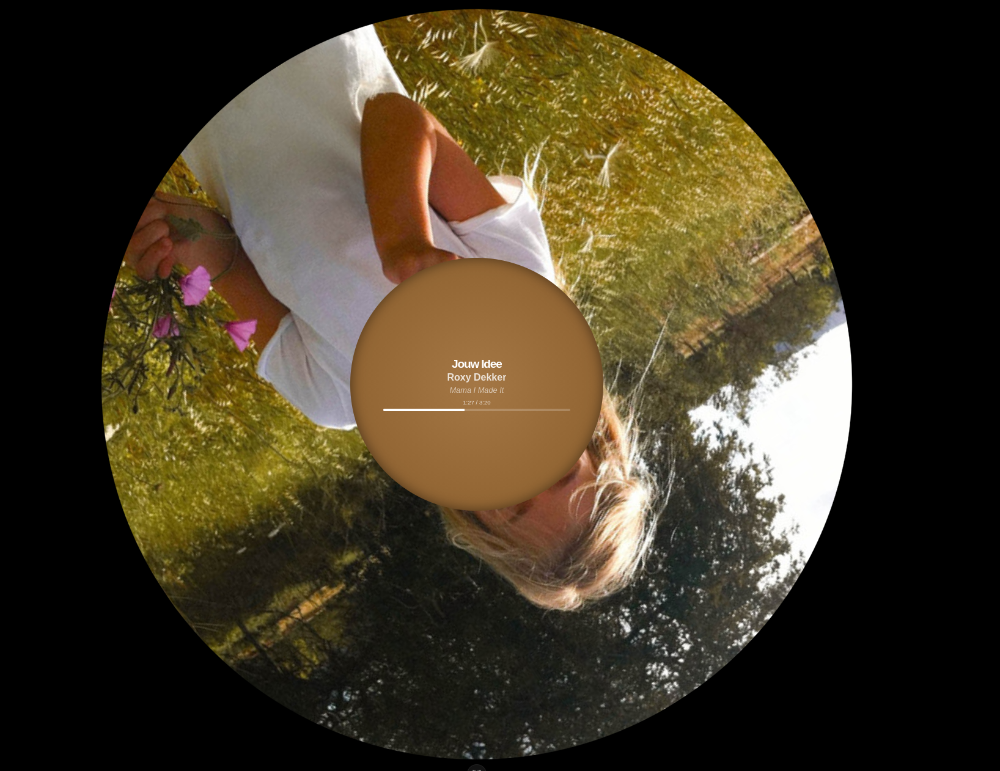

# Spotify Smart Visualizer 🎵

A Vue 3 + TypeScript application designed for smart mirrors and dedicated displays. It visualizes the current Spotify playback state with a focus on aesthetics, adaptive colors, and metadata.


## ✨ Features

- **Real-time Now Playing:** Shows track, artist, album, and progress bar.
- **Queue & History:** Displays the **Previous** and **Upcoming** tracks with cover art.
- **Adaptive Theming:** Background color automatically extracts and adapts to the current album cover.
- **Vinyl Mode:** A dedicated "LP" view with a rotating record animation for a retro feel.
- **Spotify Codes:** Generates a scannable code on the fly to share/play the track on other devices.
- **Touch/Click Controls:** Toggle between List/Vinyl modes and show/hide album names.




## 🛠️ Prerequisites

- Node.js (v16+)
- A Spotify Developer Account
- A Spotify Premium account (recommended for real-time API updates)

## 🚀 Installation

1.  **Clone the repository:**
    ```bash
    git clone <your-repo-url>
    cd your-project-name
    ```

2.  **Install dependencies:**
    ```bash
    npm install
    ```

3.  **Spotify App Setup:**
    * Go to the [Spotify Developer Dashboard](https://developer.spotify.com/dashboard/).
    * Create a new app.
    * Add `http://localhost:5173/callback` (or your production URL) to the **Redirect URIs**.

4.  **Environment Variables:**
    Create a `.env` file in the root:
    ```env
    VITE_SPOTIFY_CLIENT_ID=your_client_id_here
    VITE_SPOTIFY_REDIRECT_URI=http://localhost:5173/callback
    ```

## 🔑 Scopes & Permissions

This app requires specific permissions to function correctly. Ensure your authentication logic includes these scopes:

* `user-read-currently-playing` (Main player)
* `user-read-playback-state` (Queue/Next track)
* `user-read-recently-played` (Previous track)

## 🏃‍♂️ Usage

**Development Server:**
```bash
npm run dev