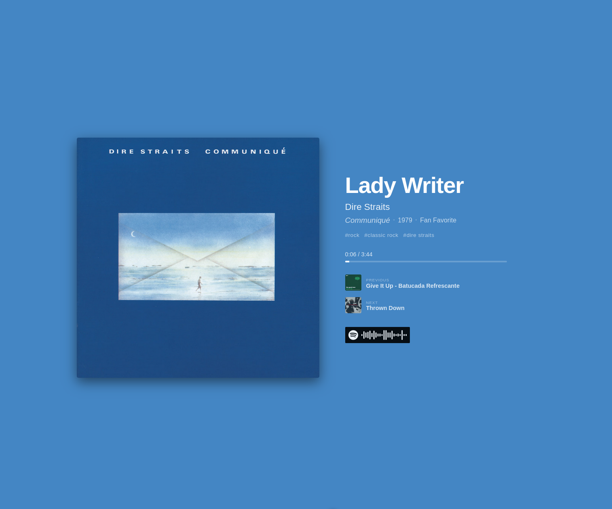
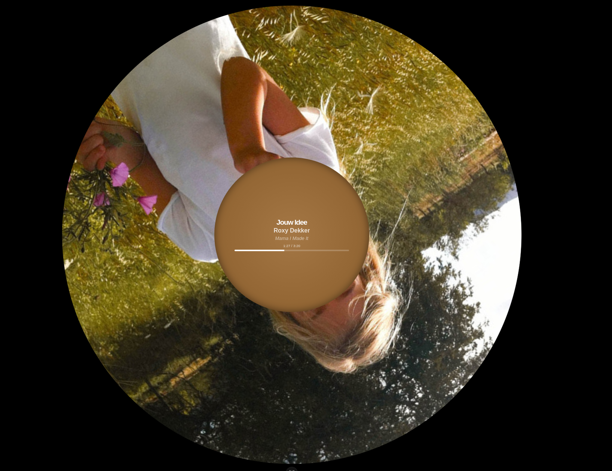

# Spotify Music Player

A Vue 3 + TypeScript music visualizer for smart mirrors, wall displays, and always-on dashboards. It can show playback from Spotify, YouTube Music activity, or Last.fm scrobbles with adaptive album colors, queue context, vinyl mode, and an idle art screen.





## Features

- Real-time Spotify now-playing view with track, artist, album, progress, queue, and listening history.
- Spotify PKCE authentication for browser-only deployments without exposing a client secret.
- Optional YouTube and Last.fm provider views.
- Adaptive theming from the current album cover.
- Vinyl mode with rotating record artwork.
- E-ink/high-contrast display mode.
- Idle screen with public-domain Met Museum artwork and quotes.
- Optional Spotify code rendering for quick sharing.

## Requirements

- Node.js 20.19+ or 22.12+
- pnpm 10
- A Spotify Developer app
- Optional: a Google OAuth client for YouTube activity
- Optional: a Last.fm API key and username

## Setup

1. Clone the repository.

   ```bash
   git clone https://github.com/rikp777/SpotifyMusicPlayer.git
   cd SpotifyMusicPlayer
   ```

2. Install dependencies.

   ```bash
   pnpm install
   ```

3. Copy the example environment file.

   ```bash
   cp .env.example .env
   ```

4. Configure Spotify.

   In the Spotify Developer Dashboard, add this redirect URI to your app:

   ```text
   http://localhost:5173/callback
   ```

   Then set `VITE_SP_CLIENT_ID` in `.env`. The app uses Authorization Code with PKCE, so no Spotify client secret is needed in the browser.

5. Configure optional providers.

   Set `VITE_YT_CLIENT_ID` for YouTube activity and `VITE_LASTFM_API_KEY` plus `VITE_LASTFM_USERNAME` for Last.fm.

## Development

Start the local Vite server:

```bash
pnpm run dev
```

Run the production checks:

```bash
pnpm run lint
pnpm run build
```

Apply automatic lint fixes:

```bash
pnpm run lint:fix
```

Format source files:

```bash
pnpm run format
```

## Environment

The most commonly changed settings are:

```env
VITE_DISPLAY_TYPE="standard"
VITE_SHOW_CONTROLS="true"
VITE_START_IN_VINYL_MODE="false"

VITE_STD_SHOW_ALBUM=true
VITE_STD_SHOW_PREVIOUS_TRACK=true
VITE_STD_SHOW_NEXT_TRACK=true
VITE_STD_SHOW_MONTHLY_OBSESSION=true
VITE_STD_SHOW_TRACK_YEAR=true
VITE_STD_SHOW_TRACK_POPULARITY=true
VITE_STD_SHOW_SPOTIFY_CODE=true

VITE_VINYL_SHOW_ALBUM=false
VITE_VINYL_SHOW_PREVIOUS_TRACK=true
VITE_VINYL_SHOW_NEXT_TRACK=true
VITE_VINYL_SHOW_MONTHLY_OBSESSION=true
VITE_VINYL_SHOW_TRACK_YEAR=false
VITE_VINYL_SHOW_TRACK_POPULARITY=false
VITE_VINYL_SHOW_SPOTIFY_CODE=false
```

See `.env.example` for the full list.

## GitHub Workflow

Use short-lived branches from `master`, keep project-health changes separate from feature work, and open pull requests with CI passing before merging. The included GitHub Actions workflow installs from `pnpm-lock.yaml`, runs linting, and builds the app on pushes and pull requests targeting `master`.

## Credits

This project was inspired by the aesthetics and functionality of Nowify.
